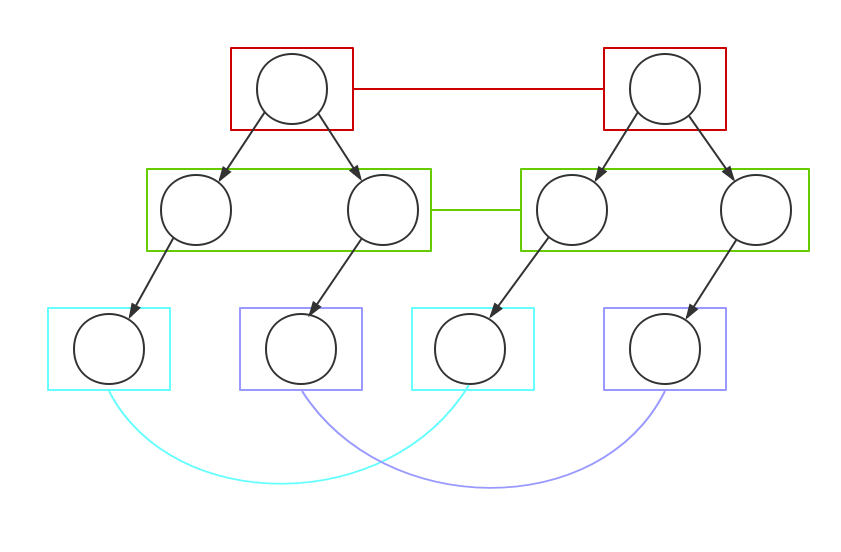
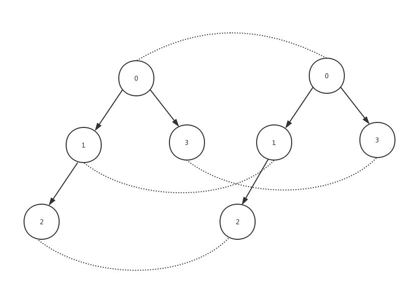

### VirtualDom技术分析与实现
#### VirtualDom介绍
VirtualDom是由React框架设计者提出的一种全新的管理视图的方式，它利用原生javaScript对象模拟了一份dom树副本，让用户通过操作这颗虚拟dom树对象来更新视图。
#### VirtualDom真的快吗
VirtualDom最常被提及的优势就是它的效率高，原因是对js对象的操作要比对原生dom的操作要快很多，有了虚拟dom，我们更新视图前可以比较两颗虚拟dom树的差异，只更新差异部分，减少了对真正dom节点的操作，所以提高了效率。
然而事实上是不一定的，我们必须知道建立虚拟dom树本身和比较差异都是需要消耗时间的，如果不采用virtualdom，我们更新视图一般用innerHtml方法。这两种方法的更新时间可以粗略表示如下：
**innerHtml**:渲染成htmlstring + 重新创建所有dom
**VirtualDom**:渲染成VirtualDom + 比较新旧Dom树差异 + 必要dom更新
所以两者的快慢实际取决于需要渲染的界面大小和更新部分的多少，可以看出innerHtml这种重新创建所有的dom的方式在只有几行数据改变时可能会造成大量浪费，所以从整体来看VirtualDom更优，但如果只是渲染静态界面，则innerHtml反而更快。
#### VirtualDom实现
一个简单VirtualDom机制，只需分为3个部分，第一步是建立VirtualDom树，第二步是设计比较新旧两个树之间差异的算法，最后一步是将差异更新到真正的视图部分。
##### 创建VirtualDom树
这一步比较直观简单，就是将dom树用js对象来模拟。这里我们使用构造函数来生成一颗虚拟的dom树，它有标签（tagName），属性(props)和子树(children)三个参数，通过前两个参数可以模拟出大部分类型的dom节点，而通过第三个参数则可以把dom节点组合成dom树。具体实现代码如下：
``` javaScript
/**
 * 虚拟dom类
 * @param  {string} tagName  dom标签
 * @param  {object} props    dom属性
 * @param  {array} children dom子节点
 */
function VirtualDom (tagName, props, children) {
  this.tagName = tagName;
  this.props = props || {};
  this.children = children;
  if (!children) {
    if (isArray(props)) {
      this.children = children = props || [];
      this.props = {};
    } else {
      this.children = children = [];
    }
  }
  this.key = props ? props.key : void 0;
  var count = 0;
  if (children) {
    children.forEach(function (child) {
      if (child instanceof VirtualDom) {
        count += child.count;
      }
      count++;
    });
  }
  this.count = count;
}
```
在构建好虚拟dom树之后，还需要有一个方法将虚拟dom树渲染成真正的dom树，为了使用方便我们将这个方法并入到VirtualDom类中，其具体代码实现如下：
```javaScript
/**
 * 渲染为真实dom
 * @return {document}  真实节点
 */
VirtualDom.prototype.render = function () {
  var el = document.createElement(this.tagName);
  var props = this.props;
  for (var propName in props) {
    var propValue = props[propName];
    el.setAttribute(propName, propValue);
  }
  var children = this.children;
  if (children) {
    children.forEach(function (child) {
      var childEl = child instanceof VirtualDom ? child.render() : document.createTextNode(child);
      el.appendChild(childEl);
    });
  }

  return el;
};
```
##### 比较两颗树的差异
这是整个VirtualDom机制的核心部分，当我们去更新视图时，我们其实是先建立好新的VirtualDom树然后将新的树与旧树进行对比，并记录所有差异部分。在计算差异，如果要遍历树上所有节点并进行两两对比，其算法的时间复杂度会高达O(n^3)，所以我们在设计diff算法时需要想办法降低时间复杂度。
这里React的diff算法定制了只针对同一层级节点进行对比的策略，将算法的时间复杂度一下降低到了O(n)级别。算法示意图如下：

那么如果出现某一节点发生了跨层移动，算法该如何处理呢？答案很简单，不把它当做是一次移动操作而是将它作为一个新生节点来处理，而原节点则当做节点被销毁来处理。所以该算法实质上是以可能出现部分不必要的dom操作为代价来节省差异比较时间。实际上节点跨层移动在dom操作中出现的频率很低，因此基本不会带来额外的时间消耗。
在算法的具体实现上，我们先对旧的VirtualDom树进行深度优先遍历，为每个节点的标记唯一编号，然后对遍历到的节点同与新树中与其编号相同的节点进行对比，并记录差异。算法示意图如下：

看到上图你或许会产生疑问，如果同一层节点之间的多个节点发生了移动操作，按照这样通过编号一一对比，是否会造成大量多余的dom操作，比如上图第二层中，旧树中的1，3节点与新树中1，3节点如果只是发生了交换，那么按这个算法将把新旧树的1，3节点对比发现它们不同并销毁原来的节点创建新的节点，这样显然造成了大量多余的dom操作。对，光凭这样的算法，我们无法做到复用已有的节点，将严重影响dom更新效率。所以对于同层节点，我们会加入列表节点对比算法，记录同层节点之间要进行的移动、增加和删除操作，这样就做到了相同节点的复用。
那么，列表节点算法的具体实现又是怎样的呢，我们将对其进行简单的介绍和分析。在开始算法前，我们必须确定节点的唯一标识，这个标识与编号不同，它是不会变化的，即无论它处在树中的什么位置，它的标识是固定的。react里将其命名为key，只有设置了key属性的节点才能被确认出来，才可能被复用。我实现的算法在这一点上也与react保持一致。列表节点对比算法的目的是要找出由旧序列变换到新序列的最少操作，一般是采用Levenshtein Distance算法，通过动态规划求解出两个序列的最少变换，但该算法的时间复杂度为O(n^2)，消耗的时间过大，所以react并不采用这种方式进行对比，它使用的对比算法不能保证所有情况都能找到最小操作的变换方法，但算法时间复杂度降到了O(n)，综合来讲该算法性能更优。React使用算法比较简单，首先它将两个序列之间的变换操作分为增添、删除和移动3类，然后通过遍历新节点来确定该节点是否变换以及发生了何种变换。具体的确定法则为，如果节点在旧节点序列中出现过且节点在旧序列中的位置比在当前所遍历的节点在旧集合中最后的位置更靠后，则认为它不会影响旧节点序列，不记录它的位置变换，否则就将其记为移动操作，记录它当前的位置和要移动到的节点的位置。如果节点在旧集合不存在则记为添加操作。在遍历完所有新节点后还需要对旧节点序列进行一次遍历找出新节点序列中不存在的节点并记录为删除操作。下面一个例子来演示算法流程：
假设我们同层的一系列节点都设置了key，分别为a、b、c、d、e，在新的树上我们对节点进行如下操作：
1.将a, b, c节点依次移动到d节点之后
2.将e节点删除
3.在末尾添加key为j的节点
经过操作后节点序列变为d、a、b、c、j。
然后列表节点对比算法的步骤为：
先定义当前所遍历节点在旧序列中最后的位置lastIndex并初始化为0，然后遍历到第一个节点d，因为此时lastIndex为0所以不对d进行任何操作，并找到d在旧序列中的位置赋予给lastIndex，此时lastIndex为4，接下来遍历到a、b、c时因为它们当前位置都小于lastIndex所以都要进行移动操作，然后遍历到j节点时因为其不存在于旧集合中，所以对它进行增添操作，最后遍历旧节点序列发现e不存在于新的序列中，所以再对e进行删除操作。至此旧序列就变成了新序列，一个进行了3次移动操作，1次增添操作和1次删除操作，共5次操作。事实上这并不是最少的操作，如果我们直接将d移动到最前面，那只需进行1次移动操作，1次增添操作和1次删除操作就可以将旧序列变为序列。所以该算法并不一定能得出最优解，但其本身时间复杂度低，所以才被react采用。
说完了了列表节点算法然后再回到，节点对比上来，我们为每个节点设置了4种不同的差异类型，分别为：
1.REPLACE：指的是两个节点本身完全不同，比如tagName发生了改变，这时就要进行替换操作，包括节点的子节点在内的所有节点将被全部替换。
2.REORDER：指的该节点的子节点序列需要进行的操作，就是此时利用上面的列表节点对比算法将同层节点之间的变换记录下来。这样在节点间对比时就不用考虑节点复用的问题了。
3.PROPS：指的是两个节点的属性差异，比如由style='color:red'变成了style='color:blue'，我们就只对节点属性进行更新，而非替换整个节点。
4.TEXT：这一类型特别针对文本节点，记录文本节点的内容差异。
整个算法流程可以归纳为，深度优先遍历旧dom树，生成节点编号将编号相同的节点进行一一对比，记录上面四种类型的差异，不断重复以上步骤，直至完成整颗树的差异记录。
下面贴出diff算法的核心部分代码：
```javaScript
function diff (oldTree, newTree) {
  var patchs = {};
  var index = 0;
  diffWalk(oldTree, newTree, index, patchs);
  return patchs;
}
function diffWalk (oldNode, newNode, index, patchs) {
  var currentPatch = [];
  if (newNode === null) {
  } else if (isString(oldNode) && isString(newNode)) {
    if (oldNode !== newNode) {
      currentPatch.push({type: TEXT, content: newNode});
    }
  } else if (oldNode.tagName === newNode.tagName && oldNode.key === newNode.key) {
    var propsPatches = diffProps(oldNode, newNode);
    if (propsPatches) {
      currentPatch.push({type: PROPS, props: propsPatches});
    }
    diffChildren(oldNode.children, newNode.children, index, patchs, currentPatch);
  } else {
    currentPatch.push({ type: REPLACE, node: newNode });
  }
  if (currentPatch.length) {
    patchs[index] = currentPatch;
  }
}
function diffChildren (oldChildren, newChildren, index, patchs, currentPatch) {
  var listDiffs = listDiff(oldChildren, newChildren, 'key');
  newChildren = listDiffs.children;
  if (listDiffs.updates.length) {
    var reorderPatch = {type: REORDER, updates: listDiffs.updates};
    currentPatch.push(reorderPatch);
  }
  var leftNode = null;
  var currentIndex = index;
  oldChildren.forEach(function (oldChild, i) {
    var newChild = newChildren[i];
    currentIndex = leftNode && leftNode.count ? currentIndex + leftNode.count + 1 : currentIndex + 1;
    diffWalk(oldChild, newChild, currentIndex, patchs);
    leftNode = oldChild;
  });
}
```
##### 更新差异部分
记录了所有差异后，我们最后只需要将这些差异应用到真正的dom树结构即可，这里我们同样通过深度优先遍历真实dom树的所有节点然后按每个节点对应的差异进行更新。其核心代码如下：
```javaScript
function applyPatches (node, currentPatches) {
  console.log(node);
  currentPatches.forEach(function (currentPatch) {
    switch (currentPatch.type) {
      case REPLACE:
        replaceNode(node, currentPatch);
        break;
      case REORDER:
        reorderChildren(node, currentPatch.updates);
        break;
      case PROPS:
        setProps(node, currentPatch.props);
        break;
      case TEXT:
        replaceContent(node, currentPatch.content);
        break;
      default:
        throw new Error('Unkown patch type' + currentPatch.type);
    }
  });
}
```
### 总结
上面就是VirtualDom整个实现步骤，当然这只是基本实现，真正成熟的VirtualDom还提供了很多优化手段，比如react的ShouldComponentUpdate的方法为开发者提供了手动优化空间等。最后贴出自己实现的整个VirtualDom的代码地址[VirtualDom](https://github.com/lsa2127291/virtualdom/blob/master/index.js)，这个实现比较粗糙，仅供学习参考用。
